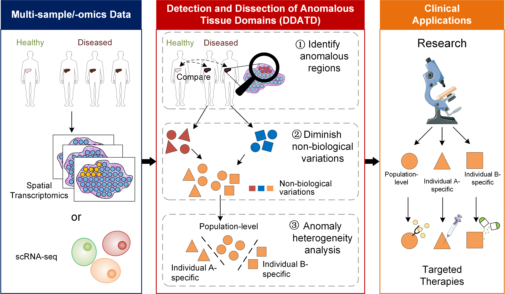
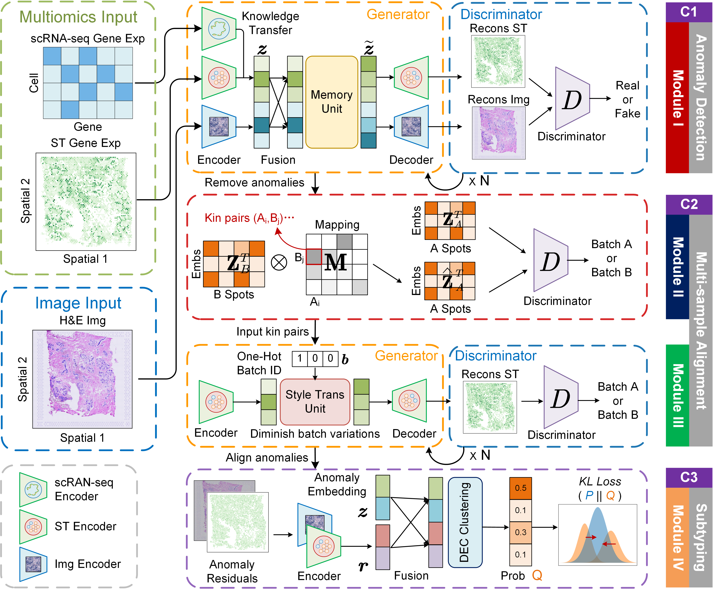

# Detecting and dissecting anomalous anatomic regions in spatial transcriptomics with STANDS
We introduce <b>S</b>patial <b>T</b>ranscriptomics <b>AN</b>omaly <b>D</b>etection and <b>S</b>ubtyping (<b>STANDS</b>), an innovative computational method capable of integrating multimodal information, e.g., spatial gene expression, histology image and single cell gene expression, to not only delineate anomalous tissue regions but also reveal their compositional heterogeneities across multi-sample spatial transcriptomics (ST) data.
 

 

## Outline of DDATD
The accurate detection of anomalous anatomic regions, followed by their dissection into biologically heterogeneous subdomains across multiple tissue slices, is of paramount importance in clinical diagnostics, targeted therapies and biomedical research. This procedure, which we refer to as <b>D</b>etection and <b>D</b>issection of <b>A</b>nomalous <b>T</b>issue <b>D</b>omains (<b>DDATD</b>), serves as the first and foremost step in a comprehensive analysis of tissues harvested from affected individuals for revealing population-level and individual-specific factors (e.g., pathogenic cell types) associated with disease developments.
 

 

## Framework of STANDS
STANDS is an innovative framework built on a suite of specialized Generative Adversarial Networks (GANs) for seamlessly integrating the three tasks of DDATD. The framework consists of three components. 

<i>Component I</i> (C1) trains a GAN model on the reference dataset, learning to reconstruct normal spots from their multimodal representations of both spatial transcriptomics data and associated histology image. Subsequently, the model is applied on the target datasets to identify anomalous spots as those with unexpectedly large reconstruction deviances, namely anomaly scores.

<i>Component II</i> (C2) aims at diminishing the non-biological variations (e.g. batch effects) among anomalies via aligning target datasets in a common space. It employs two cooperative GAN models to identify pairs of reference and target spots that share similar biological contents, based on which the target datasets are aligned to the reference data space via “style-transfer”.

<i>Component III</i> (C3) fuses the embeddings and reconstruction residuals of aligned anomalous spots to serve as inputs to an iterative clustering algorithm which groups anomalies into distinct subtypes. 
 

 

## Source codes
All the source codes of STANDS are available on [STANDS](https://github.com/Catchxu/STANDS/tree/master/src/stands). We also provide [API documentation](https://catchxu.github.io/STANDS/reference/stands/) to help you understand the code and functionality of STANDS.

## Contributors
- [Kaichen Xu](https://github.com/Catchxu): Lead Developer, implement STANDS and design this website.
- [Yan Lu](https://github.com/lylyly785): Developer, implement the novel Gaussian Mixture Model.
- [Yihang Du](https://github.com/Allinnow): Developer, implement the Spatial Grouping Discrepancy metrics.
- [Kainan Liu](https://github.com/LucaFederer): Developer, have diverse contributions.
- Xiaobo Sun & lab: provide guidance, support and environment.

## Citation
Coming soon.